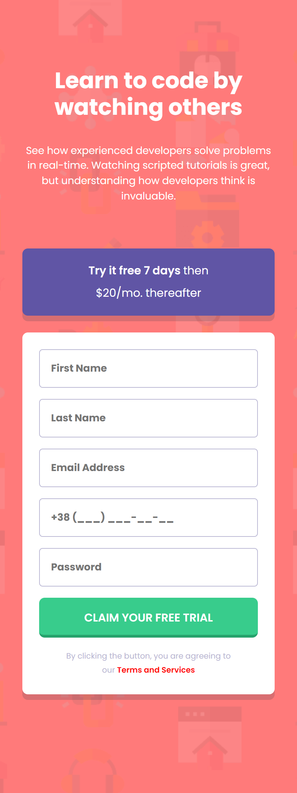
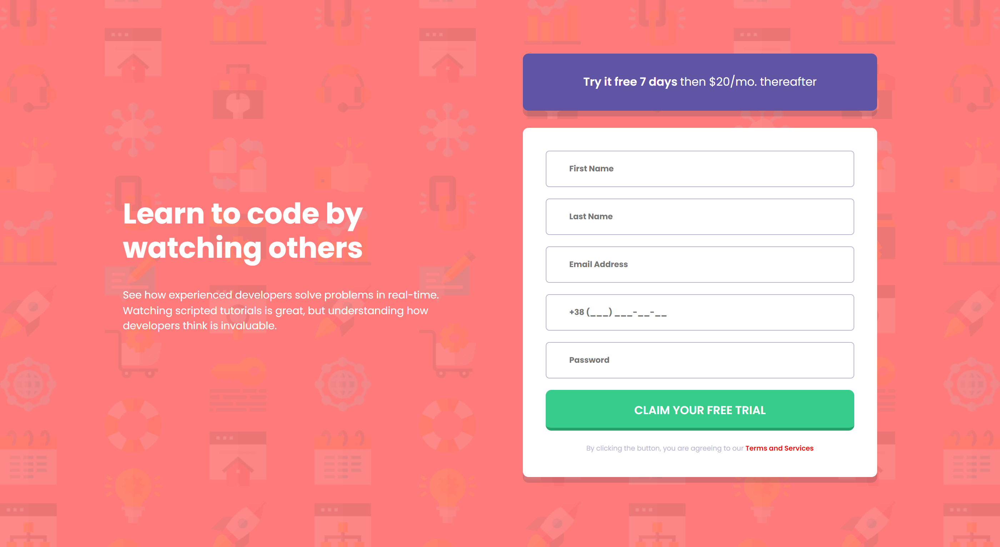

# User Registration Form Submission

  
  

Description:
This project involves creating a web form that collects information from users for registration. After the user inputs their information, the form sends the received information to a specified email address for processing.

## Table of contents

-   [Features](#Features)
-   [Technologies](#Technologies)
-   [ You need to](#To-send-a-form-to-email-you-need-to)
    -   [Prerequisites](#Prerequisites)
    -   [Installation](#Installation)
-   [Privacy and Security](#Privacy-and-Security)
-   [Generating and Including the Autoload File](#Generating-and-Including-the-Autoload-File)

## Features:

- A simple and user-friendly web form interface for user data input
- Fields for collecting user information, such as name, email address, and contact information
- Form validation to ensure accuracy and completeness of entered information
- Email functionality to send the collected information to a specified email address for processing
- Template setup for formatting collected information in a clear and organized manner

## Technologies:

- HTML, CSS, and JavaScript for developing the client-side
- Server-side PHP programming language for form processing and email functionality
- Composer library for PHP dependency management
- Open Server local server for application deployment and testing
- Overall, this project provides a simple and effective way to collect user information for registration and streamline the registration process.

>We are pleased to present you with a demo version of the project that we have hosted on Github Pages. Follow the [link to the demo version of the project](https://andrew-devcoder.github.io/form-sent/) to check it out.

## To send a form to email, you need to:

- Install Composer on your computer.
- Check if your SMTP provider blocks email sending.
- If you use Windows, check if your OS blocks SMTP sending.
- Install Open Server or any other local server that supports email sending.
- Clone this repository.
- Please note that before using the form, you need to configure it with your email settings in the mail.php file.

## How to Set up Email Form Submission
### Prerequisites
Before you begin, ensure that you have the following prerequisites:

- Composer installed on your computer
- A local server that supports sending email (such as Open Server)
- Access to your SMTP provider to check if email sending is blocked
- Access to your OS to check if SMTP sending is blocked (Windows only)
###  Installation
To set up email form submission, follow these steps:

1. Clone this repository to your local machine.
2. Install Composer if you haven't already done so.
3. Check if your SMTP provider blocks the sending of emails.
4. If you're using Windows, also check if your OS blocks SMTP sending.
5. Install Open Server or any other local server that supports sending email.
6. Configure the **`mail.php`** file in the following way:
    - Find the "try {" block and look for the comment "// config.php".
    - Edit the values: set your email address (e.g. "**__example@gmail.com__**") for **`$mail->Username`** and duplicate it for **`$mail->setFrom(EMAIL_FROM)`**.
    - In the **`$mail->addAddress(EMAIL_TO)`** line, replace the **`EMAIL_TO`** argument with the email address where you want to receive the form submissions (you can use your own email for testing purposes).
    - Finally, replace the **`SMTP_PASSWORD`** with the password you generated in the next step.
7. Generate an app password in your Google account:
    - Go to your "account" (not your Gmail account but your Google account).
    - In the search bar, type "app passwords".
    - Choose any name to orient yourself.
    - You will be provided with a password that you need to copy and paste instead of **`SMTP_PASSWORD`** in the brackets 'your password'.
    - Note that you won't be able to view the password again, so don't close this browser tab until you use it.

### Privacy and Security Measures for Email Form Submission
> Privacy is a critical aspect when setting up email form submission. To ensure the privacy of sensitive information, it is highly recommended that you take the following precautions:

- **Do not share your email sending password:** Avoid sharing your email sending password through email or any other communication method like chats or messages. Keep the password in a secure location that only you have access to.
- **Do not publish the configuration file on public resources:** Never publish the configuration file (e.g., mail.php) on public resources like GitHub or other hosting services. Instead, use a config.php file where you can create variables to store configuration data. It is also recommended to add the **`config.php`** file to **`.gitignore`** to exclude it from the repository when uploading to GitHub.

*Following these precautions will help you protect your privacy and secure your project from potential threats. Please make sure to adhere to these recommendations when setting up email form submission.*

## Generating and Including the Autoload File
To complete the project setup, you need to run the command **`composer dumpautoload`** in the terminal, which generates a new file **`vendor/autoload.php`**. This file contains a list of all the classes and their locations, and is already included in your code (**`mail.php`**) to automatically load the classes when they are used.

Running this command allows you to add all the necessary classes listed in the **`composer.json`** file to the project.

## That's it! Now you're ready to start receiving form submissions via email.

### Frontend Mentor - Intro component with sign up form solution

This is a solution to the [Intro component with sign up form challenge on Frontend Mentor](https://www.frontendmentor.io/challenges/intro-component-with-signup-form-5cf91bd49edda32581d28fd1). Frontend Mentor challenges help you improve your coding skills by building realistic projects.

